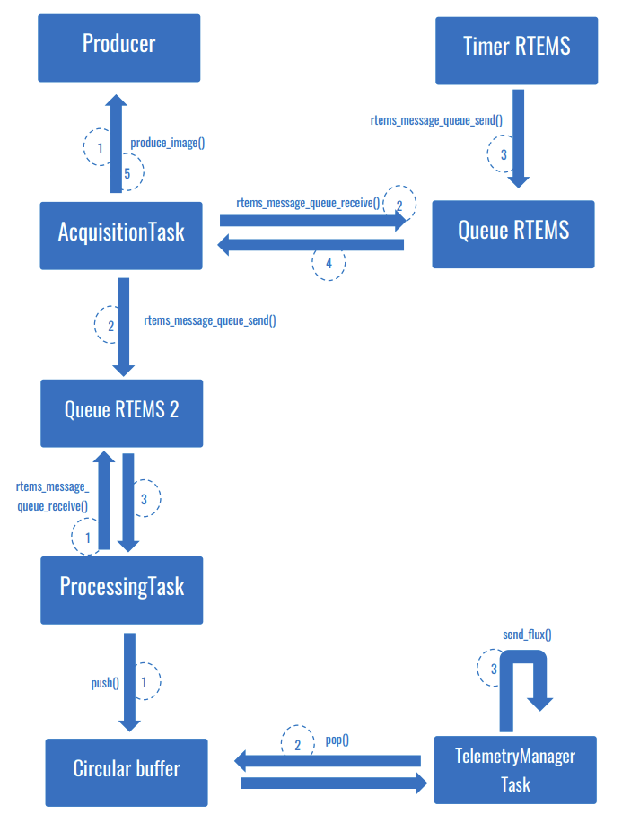

### Programmation embarquée - Acquisition et traitement périodiques d’images

> :school: **Lieu de formation :** Université Paris Cité, Campus Grands Moulins (ex-Paris Diderot)
> 
> :books: **UE :** Programmation embarquée 
> 
> :pushpin: **Année scolaire :** M2
> 
> :calendar: **Date :** Décembre 2022 

#### Description
Ce projet consiste à construire, à l’aide d’un OS temps réel, un système qui réalise des traitements d’images tout en garantissant le respect des contraintes de périodicité d’acquisition des images, ainsi que la régularité du débit sortant.

Le but est de se familiariser avec les services et composants fonctionnels d’un RTOS tels que les tâches, les queues de message, les timers et les sémaphores, et en particulier avec « RTEMS » (Real-Time Executive for Multiprocessor Systems), un RTOS conçu pour les systèmes embarqués.

#### Ressources supplémentaires
- [Rapport](Rapport_FR.pdf)
